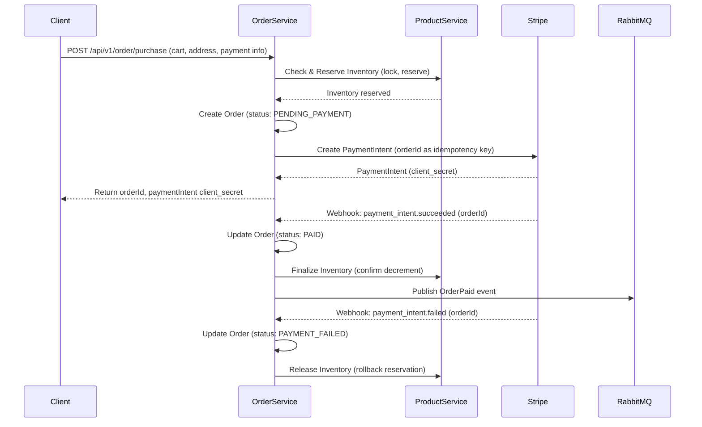

# Purchase & Payment Flow (Best Practice)

This document describes the robust, industry-standard purchase and payment flow for MCShop, based on microservice architecture and the amended schema.

## Sequence Diagram

## Key Points
- **Order is created before payment** for traceability and idempotency.
- **Inventory is reserved before payment** to prevent overselling.
- **Payment is confirmed asynchronously** via Stripe webhook.
- **Order status is updated** based on payment result.
- **All critical state changes are event-driven** (RabbitMQ).
- **Idempotency keys** are used for payment and order creation.
- **Schema supports reservation, status, and idempotency.** 